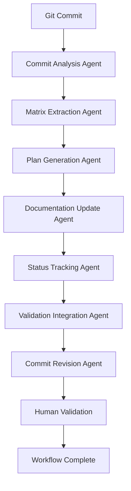

# Agents - AI Workflows for Documentation Maintenance

*Systematic agent workflows for automated documentation quality assurance*

## Overview

This document defines the AI agent workflows that maintain Frontend App documentation quality through systematic, automated processes. These agents execute structured improvement cycles triggered by git commits, user feedback, and scheduled reviews.

## Agent Architecture

### Core Principles
- **Systematic Operations**: All agents follow structured semantic operation patterns
- **Human-in-the-Loop**: Automated execution with human validation checkpoints
- **Complete Audit Trails**: Full reasoning traces for all agent decisions and actions
- **Quality Assurance**: Built-in validation and error recovery mechanisms

### Agent Communication Protocol
```typescript
interface AgentInput {
  context: {
    trigger: "git_commit" | "scheduled_review" | "user_feedback";
    timestamp: string;
    metadata: Record<string, any>;
  };
  data: any;
  previous_agent_outputs?: AgentOutput[];
}

interface AgentOutput {
  agent_id: string;
  status: "success" | "failure" | "partial";
  reasoning_trace: ReasoningStep[];
  output_data: any;
  validation_required: boolean;
  error_details?: string;
}
```

## Documentation Maintenance Agents

### 1. Commit Analysis Agent

**Purpose**: Parse git commits for documentation assessment and impact analysis

**Trigger**: Git commit with documentation assessment flag

**Input Processing**:
```typescript
interface CommitAnalysisInput {
  commit_hash: string;
  commit_message: string;
  diff_summary: string;
  assessment_level: "MAJOR_OVERHAUL" | "STANDARD_UPDATE" | "NO_REVIEW";
  scope: string[];
  methodology: string;
}
```

**Analysis Process**:
1. **Parse Assessment Parameters**: Extract assessment level, scope, and methodology
2. **Analyze Code Changes**: Review diff for documentation impact
3. **Identify Affected Documents**: Map changes to specific documentation files
4. **Estimate Improvement Requirements**: Assess scope and complexity of needed updates

**Output**:
```typescript
interface CommitAnalysisOutput {
  documentation_impact: {
    affected_files: string[];
    impact_severity: "high" | "medium" | "low";
    required_updates: string[];
  };
  improvement_scope: {
    user_experience: boolean;
    technical_accuracy: boolean;
    integration_examples: boolean;
    architecture_docs: boolean;
  };
  methodology_recommendation: string;
  estimated_effort: number; // hours
}
```

### 2. Matrix Extraction Agent

**Purpose**: Convert commit analysis into structured problem formulation matrix

**Input**: Commit analysis output and current documentation state

**Matrix Generation Process**:
1. **Current State Analysis**: Assess documentation quality and gaps
2. **Problem Formulation**: Structure issues as semantic matrix (Matrix A)
3. **Methodology Framework**: Define improvement approach as semantic matrix (Matrix B)
4. **Constraint Integration**: Include resource and timeline limitations

**Output**:
```typescript
interface MatrixExtractionOutput {
  matrix_a: {
    // Current documentation state/problems
    user_experience_issues: string[];
    technical_accuracy_gaps: string[];
    integration_example_problems: string[];
    cross_reference_inconsistencies: string[];
  };
  matrix_b: {
    // Improvement methodology
    systematic_approach: string;
    validation_framework: string;
    success_criteria: string[];
    resource_constraints: string[];
  };
  semantic_operation_plan: {
    operation_type: "multiply" | "interpret" | "elementwise";
    expected_outputs: string[];
  };
}
```

### 3. Plan Generation Agent

**Purpose**: Apply semantic operations to generate specific improvement requirements

**Input**: Matrix A (current state) and Matrix B (methodology) from extraction agent

**Semantic Processing**:
1. **Matrix Multiplication**: Combine current state with methodology (A × B = C)
2. **Requirements Generation**: Produce specific improvement requirements matrix
3. **Task Decomposition**: Break requirements into actionable tasks
4. **Phase Planning**: Organize tasks into implementation phases

**Output**:
```typescript
interface PlanGenerationOutput {
  improvement_requirements: {
    phase_1_tasks: Task[];
    phase_2_tasks: Task[];
    phase_3_tasks: Task[];
    phase_4_tasks: Task[];
  };
  success_metrics: {
    quantitative: Metric[];
    qualitative: Metric[];
  };
  timeline: {
    estimated_duration: number;
    milestone_dates: string[];
  };
  consolidated_plan_update: string; // CONSOLIDATED_IMPROVEMENT_PLAN.md content
}

interface Task {
  id: string;
  description: string;
  affected_files: string[];
  success_criteria: string[];
  estimated_effort: number;
}
```

### 4. Documentation Update Agent

**Purpose**: Execute systematic improvements following generated plan

**Input**: Generated improvement plan and current documentation files

**Update Process**:
1. **File Analysis**: Read and analyze current state of affected documents
2. **Systematic Improvement**: Apply improvement requirements systematically
3. **Quality Validation**: Ensure improvements meet success criteria
4. **Cross-Reference Maintenance**: Update internal links and references

**Update Capabilities**:
- **Content Enhancement**: Improve clarity, accuracy, and completeness
- **Structure Optimization**: Reorganize content for better user experience
- **Example Validation**: Verify and update code examples
- **Cross-Reference Updates**: Maintain internal link integrity

**Output**:
```typescript
interface DocumentationUpdateOutput {
  updated_files: {
    file_path: string;
    changes_made: string[];
    validation_status: "passed" | "failed" | "requires_human_review";
  }[];
  improvement_summary: {
    total_changes: number;
    categories_improved: string[];
    success_criteria_met: string[];
  };
  validation_report: {
    broken_links: string[];
    code_examples_tested: boolean;
    cross_reference_integrity: boolean;
  };
}
```

### 5. Status Tracking Agent

**Purpose**: Update KEY_PROJECT_FILES.md with current improvement status

**Input**: Documentation update results and improvement completion status

**Status Management**:
1. **Status Assessment**: Evaluate current status of all tracked documents
2. **Phase Tracking**: Update improvement phase completion
3. **Timestamp Management**: Record last update times
4. **Status Indicator Updates**: Change status symbols and descriptions

**Output**:
```typescript
interface StatusTrackingOutput {
  status_updates: {
    file_path: string;
    old_status: string;
    new_status: string;
    phase_completion: string;
  }[];
  phase_summary: {
    completed_phases: string[];
    active_phases: string[];
    planned_phases: string[];
  };
  next_review_date: string;
}
```

### 6. Validation Integration Agent

**Purpose**: Maintain complete reasoning traces and validate workflow quality

**Input**: All agent outputs and transformations from workflow execution

**Validation Process**:
1. **Reasoning Trace Assembly**: Compile complete audit trail of improvement cycle
2. **Quality Assessment**: Validate improvement quality against success criteria
3. **Consistency Checking**: Ensure improvements maintain cross-document consistency
4. **Error Detection**: Identify any issues requiring human intervention

**Output**:
```typescript
interface ValidationIntegrationOutput {
  reasoning_trace: {
    workflow_id: string;
    trigger_context: any;
    agent_sequence: AgentExecution[];
    final_outcomes: string[];
    quality_metrics: Record<string, number>;
  };
  validation_results: {
    technical_accuracy: "passed" | "failed" | "requires_review";
    user_experience: "improved" | "maintained" | "degraded";
    cross_document_consistency: boolean;
    broken_references: string[];
  };
  human_review_required: {
    critical_issues: string[];
    recommended_reviews: string[];
    validation_checkpoints: string[];
  };
}
```

### 7. Commit Revision Agent

**Purpose**: Generate updated commit message with documentation improvement summary

**Input**: Complete workflow results and validation outcomes

**Message Generation Process**:
1. **Summary Creation**: Compile high-level summary of documentation improvements
2. **Metrics Integration**: Include quantitative improvement metrics
3. **Validation Status**: Report validation results and human review requirements
4. **Reasoning Reference**: Link to complete reasoning traces

**Output**:
```typescript
interface CommitRevisionOutput {
  revised_commit_message: string;
  improvement_summary: {
    files_updated: number;
    improvements_made: string[];
    validation_status: string;
    human_review_required: boolean;
  };
  reasoning_trace_reference: string;
  recommendations: {
    immediate_actions: string[];
    follow_up_tasks: string[];
    quality_assurance_notes: string[];
  };
}
```

## Agent Workflow Orchestration

### Workflow Execution Pipeline



### Error Handling and Recovery

#### Agent Failure Recovery
- **Individual Agent Failure**: Continue workflow with degraded functionality
- **Critical Agent Failure**: Halt workflow and escalate to human review
- **Partial Success**: Complete partial improvements and flag remaining work
- **Validation Failure**: Revert changes and require human intervention

#### Quality Assurance Checkpoints
- **Pre-Execution Validation**: Verify agent inputs and configuration
- **Mid-Workflow Validation**: Check intermediate outputs for quality
- **Post-Execution Validation**: Comprehensive review of all improvements
- **Human Review Integration**: Seamless handoff to human validation when required

### Performance Optimization

#### Parallel Execution
- **Independent Agents**: Run non-dependent agents in parallel
- **Batch Processing**: Group similar operations for efficiency
- **Caching**: Reuse analysis results across similar commits
- **Resource Management**: Optimize agent resource usage and scheduling

#### Workflow Monitoring
- **Execution Timing**: Monitor agent performance and identify bottlenecks
- **Success Rates**: Track agent success rates and failure patterns
- **Quality Metrics**: Monitor improvement quality and user satisfaction
- **Resource Usage**: Track computational and time resource consumption

## Configuration and Customization

### Agent Configuration
```json
{
  "agent_workflows": {
    "documentation_maintenance": {
      "trigger_conditions": ["git_commit", "scheduled_review"],
      "agent_sequence": [
        "commit_analysis",
        "matrix_extraction", 
        "plan_generation",
        "documentation_update",
        "status_tracking",
        "validation_integration",
        "commit_revision"
      ],
      "parallel_execution": {
        "matrix_extraction": ["commit_analysis"],
        "documentation_update": ["plan_generation"],
        "status_tracking": ["documentation_update"]
      }
    }
  },
  "validation_settings": {
    "require_human_review": true,
    "auto_commit_threshold": "STANDARD_UPDATE",
    "quality_assurance_level": "comprehensive"
  }
}
```

### Custom Agent Development

#### Agent Interface
```typescript
interface DocumentationAgent {
  id: string;
  name: string;
  description: string;
  
  execute(input: AgentInput): Promise<AgentOutput>;
  validate(output: AgentOutput): boolean;
  recover(error: Error, context: AgentInput): Promise<AgentOutput>;
}
```

#### Implementation Example
```typescript
class CustomDocumentationAgent implements DocumentationAgent {
  id = "custom_agent";
  name = "Custom Documentation Agent";
  description = "Specialized agent for custom documentation tasks";
  
  async execute(input: AgentInput): Promise<AgentOutput> {
    // Custom agent logic
    const reasoning_trace = [];
    
    try {
      // Process input and generate improvements
      const output_data = await this.processDocumentation(input);
      
      return {
        agent_id: this.id,
        status: "success",
        reasoning_trace,
        output_data,
        validation_required: true
      };
    } catch (error) {
      return this.handleError(error, input);
    }
  }
  
  validate(output: AgentOutput): boolean {
    // Custom validation logic
    return true;
  }
  
  async recover(error: Error, context: AgentInput): Promise<AgentOutput> {
    // Custom error recovery logic
    return this.execute(context);
  }
}
```

## Integration with Existing Tools

### CI/CD Integration
- **GitHub Actions**: Automated workflow execution on commits
- **Branch Protection**: Documentation validation before merge
- **Automated Testing**: Code example validation in documentation
- **Performance Monitoring**: Agent workflow performance tracking

### Development Tool Integration
- **VS Code Extensions**: Documentation status indicators in editor
- **Git Hooks**: Local development workflow integration
- **Monitoring Dashboards**: Real-time workflow status and metrics
- **Notification Systems**: Alerts for workflow failures or human review requirements

## Future Enhancements

### Advanced Agent Capabilities
- **Semantic Consistency Agent**: Automated cross-document consistency maintenance
- **User Feedback Analysis Agent**: Process user feedback for improvement prioritization
- **Performance Monitoring Agent**: Track documentation health metrics
- **Quality Prediction Agent**: Predict documentation update success likelihood

### Workflow Optimization
- **Machine Learning Integration**: Learn from successful improvement patterns
- **Predictive Maintenance**: Anticipate documentation needs before issues arise
- **Cross-Project Learning**: Share improvements across related projects
- **Adaptive Workflows**: Self-improving agent workflows based on effectiveness metrics

### Integration Expansion
- **Multi-Repository Support**: Coordinate documentation across multiple projects
- **Community Integration**: Process external contributions through agent workflows
- **Advanced Analytics**: Comprehensive analysis of documentation impact and effectiveness
- **Real-Time Collaboration**: Live collaboration between agents and human reviewers

---

*This agent system creates intelligent, automated documentation maintenance that follows systematic methodology while requiring human validation for quality assurance. The agents work together to maintain high documentation quality with minimal human overhead.*